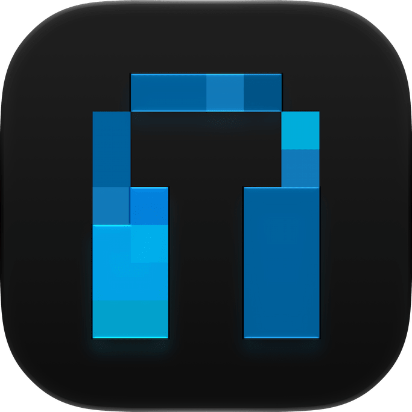
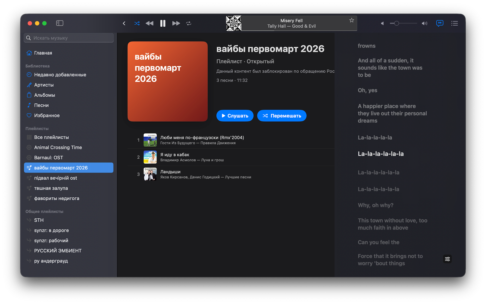
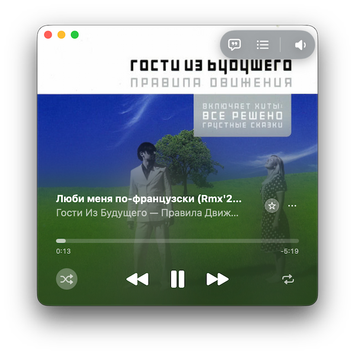

<p align="center">
  
</p>

<h1 align="center">Klopydrome</h1>

Экспериментальный "Apple Music" ahh клиент написаный слопом за 0 тугриков. Работает с [Navidrome][1] и [Subsonic][2]-совместимыми серверами. Приложение написано на SwiftUI, работает с macOS 14.4. Имеет риск адекватной работы.
<p align="center">
  
  <h5>ну вроде норм я попользовался</h5>
</p>

## Фишки

<div>
  

  <ul>
    <br>
    <li>Кушает ~200 мегабайт ОЗУ;</li>
    <li>Кэширование аудио и обложек;</li>
    <li>Поддержка транскодинга;</li>
    <li>Оффлайн-режим (не готов);</li>
    <li>Синхронизированный текст (и extended LRC тоже);</li>
    <li>Создание нескучных плейлистов (и смарт-плейлистов);</li>
    <li>Поддержка Discord RPC;</li>
    <li>Crossfade и поддержка ReplayGain;</li>
    <li>Мини-плеер;</li>
    <li>Слоп.</li>
  </ul>
</div>

<br clear="all">

## Сборка

Нужны **macOS 14.4+**, Xcode 16 или новее и Homebrew. Скрипты находятся в `scripts/` и запускаются из корня репозитория.

На чистом клоне сначала соберите локальный аудиодвижок на базе `Libmpv`. Если `vendor/MPVKit-Audio/dist/release/xcframework/Libmpv.xcframework` уже существует, этот шаг можно пропустить.

```sh
# сабмодуль движка + пакеты для сборки
git submodule update --init
brew install nasm meson ninja cmake pkg-config wget git

# сама сборка
./scripts/build-mpvkit-audio.sh
```

Затем соберите приложение:

```sh
./scripts/build-app.sh # vX.Y.Z --release (а также --no-lint --no-test)
```

Скрипт запускает линтер и нужный тест, собирает debug-версию и подписывает её ad-hoc. Готовое приложение будет лежать в `.build/app/Klopydrome.app`.

Для release-версии:

```sh
./scripts/build-app.sh --release
```

Релиз целиком (тесты, сборка, тег, публикация):

```sh
./scripts/release.sh vX.Y.Z
```

Отдельно:

```sh
swift test # все тесты
./scripts/lint.sh # линтер
```

## License

[MIT](LICENSE)

[1]: https://www.navidrome.org/
[2]: https://www.navidrome.org/docs/developers/subsonic-api/